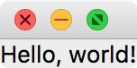

Part 1 - Hello, World!
======================

To start off, we need to create a ``QApplication`` object, which represents the
overall application::

    from qtpy.QtWidgets import QApplication
    app = QApplication([])

You will always need to ensure that a ``QApplication`` object exists, otherwise
your Python script will terminate with an error if you try and use any other Qt
objects. The above won't open any window - the term *application* here doesn't
refer to a specific window that will open, but instead to a windowless object
that forms the basis for anything else we will build.

Building blocks in Qt (and other similar frameworks) are called *widgets*. One
of the simplest widgets is a text label. We can create a label widget by doing::

    from qtpy.QtWidgets import QLabel
    label = QLabel('Hello, world!')
    label.show()

Note that this should be done after creating a ``QApplication`` object. We need
to explicitly tell Qt that we want to show the widget as a graphical window
using ``.show()``, otherwise it will not be shown (this will come in handy once
we want to use widgets as building blocks for windows).

If you were to run the two code blocks above, the label would appear and
disappear straight away because the script would finish running. The final step
is to start the event loop. In graphical user interface (GUI) programming, an
*event loop* is a common concept - the idea is to basically have an infinite
loop that will continuously check for user interaction with the interface, such
as clicking on buttons, entering text, and moving or closing windows.
The infinite loop can be terminated in various ways depending on the
configuration in ``QApplication`` - by default it will terminate once the
visible windows are closed. To start the event loop, we can do::

    app.exec_()

This is equivalent to doing::

    while True:
        app.processEvents()

Let's take a look at the complete example:

.. literalinclude:: examples/1.hello.py

Copy this into a Python script, and run it with e.g.::

    python 1.hello.py

You should see a small window pop up with 'Hello, world!'
inside:

Close the window, and the Python script should stop running.

Congratulations, you've written your first Qt application!
