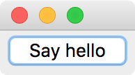

Part 2 - Buttons and events
===========================

Let's be honest - the application we wrote in :doc:`1.hello` wasn't the most
exciting one ever. In this section, we're going to look at how to use buttons,
and we will learn about events in Qt.

First, let's create a button (remember that as mentioned in :doc:`1.hello`,
you should always set up a ``QApplication`` first)::

  from qtpy.QtWidgets import QPushButton
  button = QPushButton('Say hello')

Qt widgets often have different kinds of *events* you can connect to. An event
is just something that happens for example (but not limited to) something the
user does. For instance, ``button`` has an event called ``clicked`` that
gets triggered when the user clicks on the button. The normal way to use events
is to write functions that can then do something as a result of the event
being triggered.

Let's write a function that will get executed when the user clicks on the button::

    def say_hello(event):
        print('Hello, world!')

Such a function typically takes the event as its only positional argument.

We can then connect this function to the ``clicked`` event::

    button.clicked.connect(say_hello)

Finally, we can show the button with::

    button.show()

Let's take a look at the full example:

.. literalinclude:: examples/2.button.py

Copy this into a Python script, and run it with e.g.::

    python 2.button.py

You should see a small window pop up with a button inside:

Now click on the button and you should see the following message appear in the
terminal::

    Hello, world!

Such fun!
