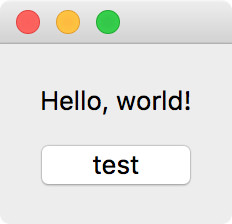
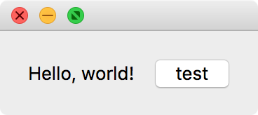
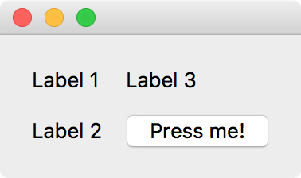
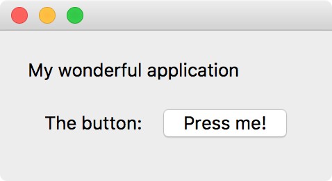

Part 3 - Laying out widgets
===========================

Vertical layout
---------------

Let's now take a look at how to construct more interesting application windows
by combining different widgets together. Qt widgets can all include a 'layout',
which defines combinations of children widgets. A simple example is the
``QVBoxLayout`` class, which allows widgets to be stacked vertically. Let's
use a label and a button widget and stack these vertically into a layout::

    from qtpy.QtWidgets import QLabel, QVBoxLayout, QPushButton

    # Create label and button
    label = QLabel('Hello, world!')
    button = QPushButton('test')

    # Create layout and add widgets
    layout = QVBoxLayout()
    layout.addWidget(label)
    layout.addWidget(button)

However, note that a layout is not a widget, so we can't simply do
``layout.show()`` at this point. Instead, we need to add this layout to a parent
widget. For this, we'll use ``QWidget``, which is the most basic kind of a
widget - it contains nothing by default::

    widget = QWidget()
    widget.setLayout(layout)

We can now show this widget using::

    widget.show()

Note that in this kind of situation, it's clear why we don't want widgets to be
shown by default and to have to specify ``widget.show()``. If we were to instead
run ``button.show()``, only the button widget would be shown.

Here is the complete example:

.. literalinclude:: examples/3.vertical_layout.py

Copy this into a Python script, and run it with e.g.::

    python 3.vertical_layout.py

You should see a small window pop up with the two widgets:

Other layouts
-------------

There are other types of layout besides vertical stacking. As you might expect,
there is a corresponding ``QHBoxLayout`` class that will stack widgets
horizontally::

    from qtpy.QtWidgets import QHBoxLayout

    layout = QHBoxLayout()
    layout.addWidget(label)
    layout.addWidget(button)

which will look like:

Another example is ``QGridLayout`` which allows widgets to be places in a grid.
To add widgets to this kind of layout, you need to specify the row and column::

  # Create label and button
  label1 = QLabel('Label 1')
  label2 = QLabel('Label 2')
  label3 = QLabel('Label 3')
  button = QPushButton('Press me!')

  # Create layout and add widgets
  layout = QGridLayout()
  layout.addWidget(label1, 0, 0)
  layout.addWidget(label2, 1, 0)
  layout.addWidget(label3, 0, 1)
  layout.addWidget(button, 1, 1)

which will look like:

Nesting layouts
---------------

In practice, you may need to use more complex layouts - for this, you can start
to nest layouts. You can do this by adding a layout to a widget which is itself
in a layout. Let's take a look at the following example:

.. literalinclude:: examples/3.nested_layout.py

This will result in the following window:

