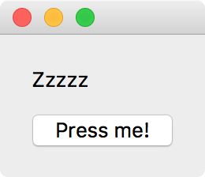
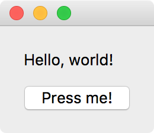

Part 4 - Dynamically updating widgets
=====================================

Now that we know how to show multiple widgets in a single window, we can make
use of what we learned in :doc:`2.button.py` to connect different widgets
together. For example, we can make it so that pressing a button changes the
text in one of the widgets:

.. literalinclude:: examples/4.updating_gui.py

Try running this script, and you should see something like:

Now press the button, and the label text should change:

